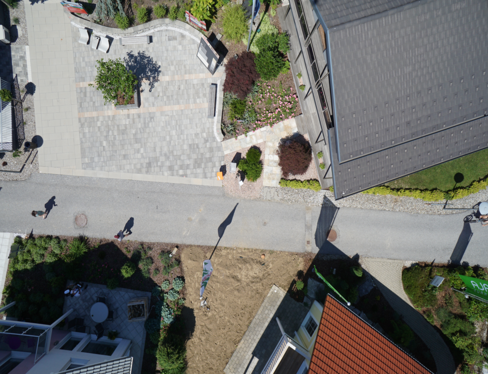
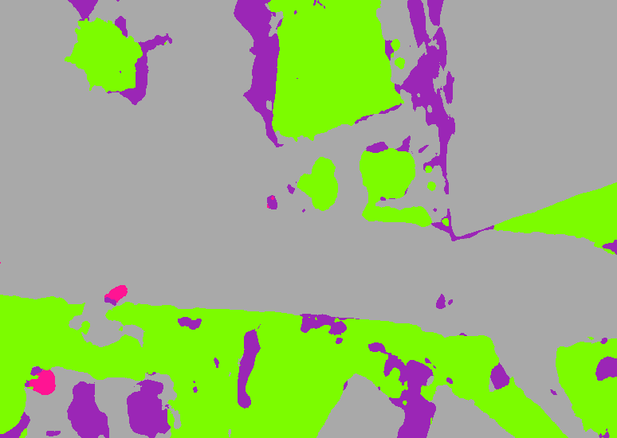
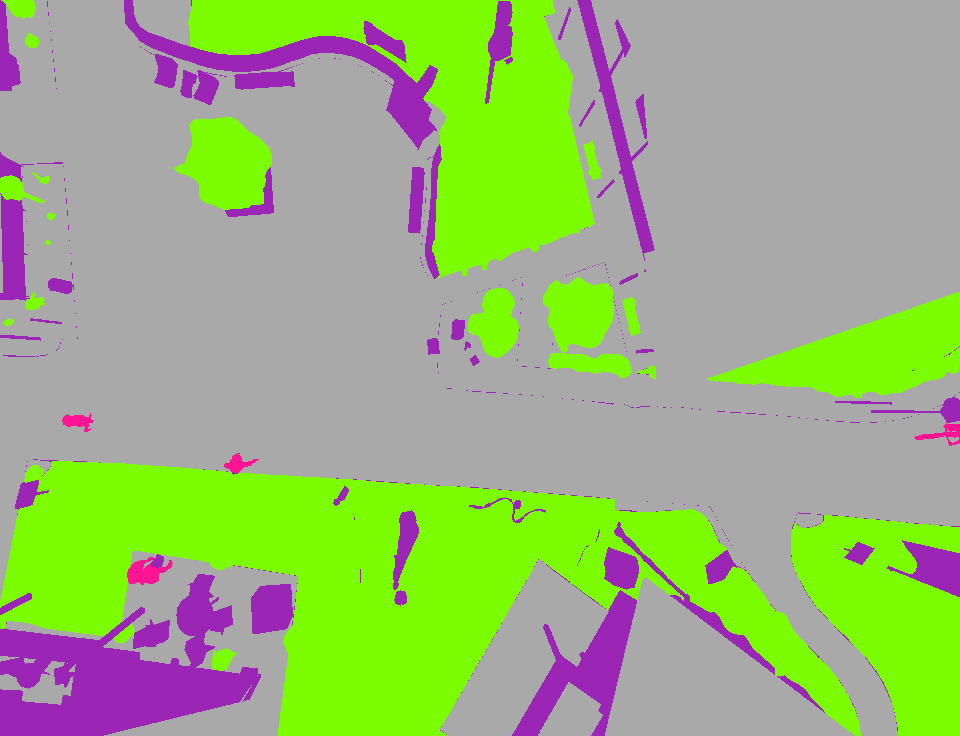

# U-Net
Paper: [U-Net: Convolutional Networks for Biomedical Image Segmentation](https://arxiv.org/pdf/1505.04597)

Dataset used: [Semantic segmentation drone dataset](https://www.kaggle.com/datasets/santurini/semantic-segmentation-drone-dataset?select=classes_dict.txt)

## Architecture
This implementation follows the same architecture as in the paper, only the last 3x3 convolution is removed (can be seen in `unet.py`).

## Output
Output has 5 channels of logits which will give probabilities upon performing softmax on them.

The below example is from a model trained on 300 of the images from the dataset, with `epochs = 205`, `batch size = 8`, and `learning rate = 0.0005`.

| Original Image | Predicted output | Expected output |
| -------------- | ---------------- | --------------- | 
|  |    
Note: The prediction is a center crop.
|  |

This model's parameters are available [here](https://drive.google.com/file/d/1ijUyBgm41yzcVLc5sLNISdJ-x3RdlibL/view?usp=sharing) (`0.0271` in the name is the cost of the model on the training set).